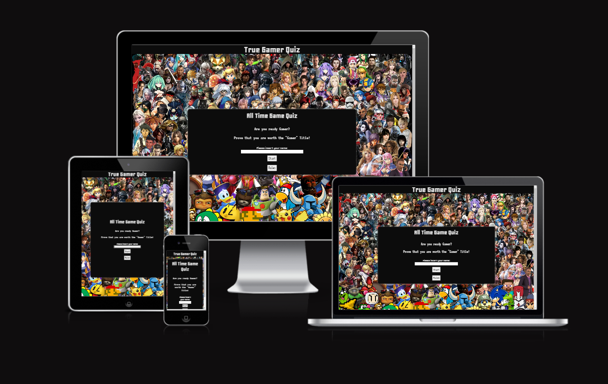

# True Gamer Quiz

(Developer: Freedy Ramos)

[Live page](https://freedy-fr.github.io/CI-P2-True-Gamer-Quiz/)

## Table of Content

1. [Project Goals](#project-goals)
    1. [User Goals](#user-goals)
    2. [Site Owner Goals](#site-owner-goals)

## Project Goals

True Gamer Quiz was designed to be a fun game to test your knowledge and to bring a nostalgic felling to you.

### User Goals

- To play a fun and engaging quiz.
- Test your video games knowledge.
- To bring you a nostalgic feeling.

### Site Owner Goals

- To create an engaging and nostalgic quiz to test your knowledge.
- The app should be fully responsive in most screens.

