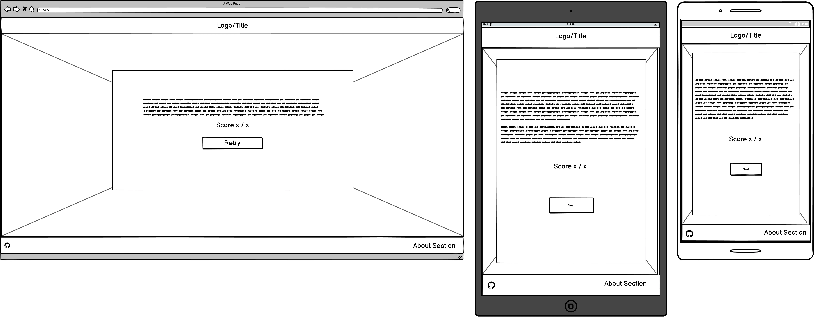

# True Gamer Quiz

(Developer: Freedy Ramos)

[Live page](https://freedy-fr.github.io/CI-P2-True-Gamer-Quiz/)

## Table of Content

1. [Project Goals](#project-goals)
    1. [User Goals](#user-goals)
    2. [Site Owner Goals](#site-owner-goals)
2. [User Experience](#user-experience)
    1. [Target Audience](#target-audience)
    2. [User Requirements and Expectations](#user-requirements-and-expectations)
    3. [User Stories](#user-stories)
    4. [Site Owner Stories](#site-owner-stories)
3. [Design](#design)
    1. [Design Choices](#design-choices)
    2. [Colour](#colours)
    3. [Fonts](#fonts)
    4. [Structure](#structure)

## Project Goals

True Gamer Quiz was designed to be a fun game to test your knowledge and to bring a nostalgic felling to you.

### User Goals

- To play a fun and engaging quiz.
- Test your video games knowledge.
- To bring you a nostalgic feeling.

### Site Owner Goals

- To create an engaging and nostalgic quiz to test your knowledge.
- The app should be fully responsive in most screens.

## User Experience

### Target Audience

- Casual gamers.
- Users that like video game facts.
- Users looking to have fun and test their knowledge.

### User Requirements and Expectations

- An intuitive navigation system and an interactive system.
- Quick, easy, and fun to play.
- Links that work properly.
- Good presentation and a responsive design regardless of screen size.

### User Stories
1. As a user, I want to have an welcome message.      
2. As a user, I want to have a rule explanation page.
3. As a user, I want to know more about the game.    
4. As a user, I want to know what the correct answer if i choose the wrong one.
5. As a user, I want to see visual indication of my correct/incorrect answer.
6. As a user, I want to be able to insert my name to play.
7. As a user, I want to be able to see my final score.
8. As a user, I want to be able to retry the game.

### Site Owner Stories

9. As a site owner, I want the user to be able to check our github page. OK
10. As a site owner, I want the user to have a nostalgic feeling with the background image.

## Design

### Design Choices

The quiz was designed to bring a nostalgic felling to the user by using a retro fonts, dark and colorful shades of colors.

### Colour

The color palette was chosen to match the nostalgic retro 8-bit games with shades of dark grey and colorful red and green for the correct and incorrect answer.

Colour palette

### Fonts

For the fonts the VT323 8-bit was choosen for the text and paragraphs to give a retro game feel and GEO for the headings to give a modern feel.

### Structure

The website consists of four integrated pages:

- A homepage with 3 different views:
    - one main page for inserting your name.
    - one for answering the questions.
    - one that show the results to the user.
- A rules explanation page.
- An about the game page.
- A 404 page not found.

### Wireframes

Start screen

Questions screen

Result screen

Rules screen

About screen

## Technologies Used

### Languages

- HTML
- CSS
- JavaScript

### Frameworks & Tools

- Git
- GitHub
- Gitpod
- Cloudconvert
- Balsamiq
- Font Awesome
- Favicon.io
- JSHint
- Lighthouse
- W3C Markup validation service
- W3C Jigsaw CSS validation service 
- WAVE WebAIM web accessibility evaluation tool

## Features

The site consist of 4 integrated pages and 8 features.

### Header

- Featured on all pages.
- Consists of the game title and homepage link on it.

Header

 
 

### Footer

- Featured on all pages.
- Consists of a section providing social media links and a link to the about the game.
- User story covered: 3, 9.

Footer

 

### Start screen

- Provides an "insert your name" input.
- Provide a challenge/welcoming message to the user.
- User story covered: 1, 6.

Start screen

 

### Game screen

- Consists of 7 different sections:
    - A section with the current question number.
    - A section with the current question text.
    - A section with the current answer buttons.
    - A section with the next button.
    - A section showing the correct and incorrect feedback message.
    - A section with the current score and total number of question.
    - Interactive shadowbox showing correct and incorrect answer.
    - A nostalgic background image showing retro and modern video game characters.
    - User stories covered: 4, 5, 10.

Game screen

 

### Result screen

- Consists of three sections
    - A section with a congratulation message.
    - A section with your final score.
    - A section with a retry button to restart the game.
    - A section with back button to get back to the homepage.
    - User stories covered: 7, 8.

Result screen

 

### Rules screen

- Provides a set of rules to be followed.
- A section with a back button.
- User story covered: 2.

Rules screen

 

### About screen

- A section showing a brief description about the game.
- A section with a back button.
- User story covered: 3.

About screen

 

### 404 page

- A section showing the user that the page could not be found.

404 page

 

## Validation

### HTML Validation

The W3C Markup Validation Service was used to validate the HTML of the website by URL and direct input.
All pages pass with no errors no warnings to show.

Home

404 page

 

### CSS Validation

The W3C Jigsaw CSS Validation Service was used to validate the CSS of the website by URL and direct input.
The page pass with no errors no warnings to show.

CSS

 

### JavaScript Validation

JSHint Static Code Analysis Tool for JavaScript was used to validate the Javascript file.
No significant issues were found.

JavaScript File

 

### Accessibility

The WAVE WebAIM web accessibility evaluation tool was used to ensure the website met high accessibility standards.
All pages pass with no errors.

Home

404 page

 

### Performance 

Google Lighthouse in Google Chrome Developer Tools was used to test the performance of the website.

Home

404 page

 

